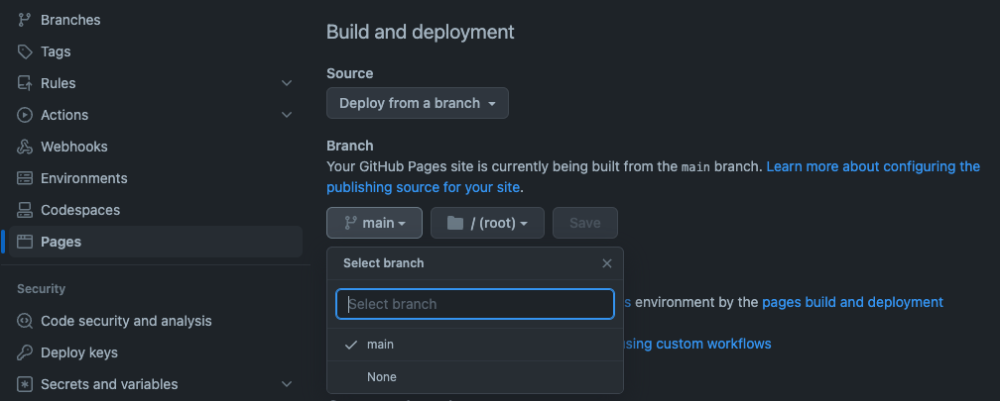
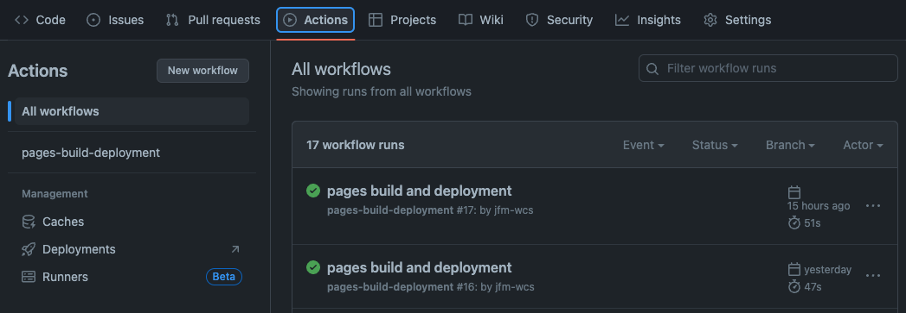

# Workshops jekyll theme

[⬅ English version](./)

[Jekyll](https://jekyllrb.com/) est un moteur de site static intégré à [Github pages](https://pages.github.com/).
Il permet notamment la génération et la mise en forme HTML à partir de fichiers _markdown_. Ce thème, aux couleurs de la Wild, est une proposition de mise en forme des supports pédagogiques au format markdown utilisés pendant les formations.

<div class="alert-info">
  <a href="https://drive.google.com/file/d/1wTnb3jhB-_6bm47ShN8S-l2Pih0OmYC7/view?usp=drive_link" target="_blank"><i class="bi bi-play-circle-fill"></i> Regarder la démo</a>.
</div>

[Lire le CHANGELOG](./CHANGELOG)

## Principe

- Créez votre contenu (atelier, support, dojo, etc.) sur un dépôt Git comme vous le faites probablement déjà.
- Écrivez vos instructions dans le fichier **README.md** en utilisant la hiérarchie des
  intertitres `<h1>`, `<h2>`, `<h3>`,… pour structurer votre document.
- Publiez sur _Github pages_ en utilisant ce thème issu de la charte
  graphique [Wild Code School](https://www.wildcodeschool.com/).

## Installation

L'installation se fait grâce à un fichier `_config.yml` à placer à la racine de votre dossier et dans lequel il suffit
saisir le code ci-dessous :

```yml
remote_theme: WildCodeSchool/workshops-jekyll-theme
```

Et voilà ! Le thème `workshops-jekyll-theme` est maintenant défini pour être utilisé lorsque vous publierez votre projet
via _Github pages_ (voir la section [deploy](#deploy)).

Vous pouvez aussi télécharger ce fichier <a href="./config-sample.yml" download="_config.yml">_config.yml</a> déjà
paramétré avec les variables de configuration décrites ci-après.

## Configuration

Ci-dessous la liste des variables pouvant être ajoutées au fichier `_config.yml` si vous souhaitez personnaliser
l'affichage.

| Variable        |  Type  |  Default   | Description                                                                                                                                                                  |
|-----------------|:------:|:----------:|------------------------------------------------------------------------------------------------------------------------------------------------------------------------------|
| **style**       | string |   _dev_    | Indiquer la couleur dominante de la page.<br/> Valeurs possibles : _dev_, _data_, _ciber_, _design_ et _wild_. Les thèmes reprennent les couleurs associées à chaque cursus. |
| **title**       | string |    none    | Titre affiché dans la section `<header>` de la page.                                                                                                                         |
| **description** | string |    none    | Texte affiché sous le titre de la section `<header>`.                                                                                                                        |
| **type**        | string | _Workshop_ | Texte court affiché sous la section `<header>` (ligne du logo).                                                                                                              |
| **main_image**  | string |    none    | Image de couverture affichée avant le contenu principal (indiquer une adresse **http** ou **le chemin relatif** d'un fichier à partir de la racine de votre dossier).        |
| **show_clone**  |  bool  |   false    | Afficher/masquer la commande `git clone <adresse-de-votre-dépôt>` pré-remplie.                                                                                               |
| **show_toc**    |  bool  |    true    | Afficher/masquer la table des matières.                                                                                                                                      |
| **lang**        | string |     en     | Définir la langue de la page HTML  (attribut `<html lang='en'>`)                                                                                                             |
<div class="alert-info" markdown="block">
Notez que chaque variable peut être réécrite dans le "front matter yaml" d'une page.

```yaml
---
title: A special title
description: A special description
---
```

</div>

### Exemple

```yaml
remote_theme: WildCodeSchool/workshops-jekyll-theme

style: data
title: Basic workshop
description: Default tempate with cover image
type: Data theme
main_image: https://cdn.pixabay.com/photo/2020/08/09/14/25/business-5475661_1280.jpg
show_clone: true
```

<a href="./examples/configuration-data" target="_blank">Voir le rendu</a> de cette configuration.

## Templates

Deux templates sont disponibles.

- **default** (sélectionné par défaut) : Les sections y sont automatiquement générées à partir des intertitres `<h1>`
  et `<h2>`.
- **tic-tac** : Pour ateliers en binôme. Les sections générées à partir des intertitres `<h1>` occupent une pleine largeur. Les sections générées à partir des intertitres `<h2>` se positionnent sur une grille à deux colonnes par alternance gauche/droite.

### Sélectionner

La sélection du modèle se fait également via le fichier `_config.yml` grâce à la clé `layout` du tableau `default` en
indiquant le nom du modèle, comme ceci :

```yaml
defaults:
  - scope:
      path: "" # an empty string here means all files in the project le cas échéant
    values:
      layout: tic-tac # le modèle tic-tac sera utilisé 
```

## Styles

Quelques explications concernant la mise en forme appliquée à certains éléments HTML.

Le thème met en forme l'ensemble
des [éléments HTML basiques pouvant être générés en markdown](https://daringfireball.net/projects/markdown/basics).  
Par ailleurs, **Jekyll** s'appuyant sur la bibliothèque [kramdown](https://kramdown.gettalong.org/) pour convertir les
fichiers markdown en HTML, il est possible de faire appel à des classes CSS au moment de la saisie et grâce à la
syntaxe `{: .nom-de-la-classe-css }`. Ce code devra être placé sur la ligne jouxtant celle(s) à mettre en forme. C'est
le cas des blocs _Alert info_ et _Alert warning_ présentés ci-dessous.

### Alert info

Utiliser la syntaxe kramdown `{: .alert-info }`

```markdown
Some text
{: .alert-info }
```

Crée un paragraphe avec la classe CSS `alert-info`.  
⬇  
{: .text-center }

Some text
{: .alert-info }

### Alert warning

```markdown
Some text…  
Some text…  
{: .alert-warning }
```

Crée un paragraphe avec la classe CSS `alert-warning`.  
⬇  
{: .text-center }

Some text…  
Some text…  
{: .alert-warning }

### Blockquotes

```markdown

> Further details [with links](#), `inline code` or block of code
> ```php
> $content = 'block of code'
> ```

```

Crée une `<blockquote>` à plusieurs lignes  
⬇  
{: .text-center }

> Further details [with links](#), `inline code` or block of code
> ```php
> $content = 'block of code'
> ```

### Images

Les images conservent un type d'affichage _inline_.

```markdown


```

⬇  
{: .text-center }


Les propriétés CSS `max-width: 100%` et `height: auto;` leur sont appliquées pour être responsive.

```markdown

```

⬇  
{: .text-center }
  


### Text align
Deux classes css sont disponibles afin de modifier l'alignement des textes. 
- `{: .text-center }` : alignement au centre
- `{: .text-end }` : alignement à droite
Utile pour modifier l'alignement des images par exemple.

```markdown

{: .text-center }
```
⬇ 
{: .text-center }

{: .text-center }

### Markdown dans des balises HTML

Par défaut, si vous utilisez des balises HTML comme ceci :

```markdown
<div>

Hello World !!!

</div>
```

Le contenu `Hello World !!!` est interprété comme du code HTML pour beaucoup de balises. Cela signifie que vous ne pourrez pas utiliser du markdown dans ces balises HTML.

Vous pouvez explicitement activer l'interprétation du markdown avec `markdown="1"` :

````markdown
<details markdown="1">
<summary>
Une solution ?
</summary>

```js
// sans markdown="1", cette partie serait interprétée comme du texte brut

console.log("Hello World !!!");
```

</details>
````

### Table des matières

Pour les deux templates actuellement disponibles (**default** et **tic-tac**), la table de contenu est générée à partir
des intertitres `<h1>`, `<h2>`, `<h3>`, et `<h4>` dès lors que la hiérarchie sémantique est respectée (ne pas passer
directement d'un `<h2>` à un `<h4>` par exemple).  
La table de contenu peut être désactivée ([voir la section Configuration](#configuration)). Dans tous les cas, elle n'est pas affichée en vue _mobile_.

## Mise en ligne

Le déploiement sur Github Pages se fait via l'onglet **Settings** > **Pages** d'un dépôt Github.  
Sélectionner la branche de référence (généralement _main_) et cliquer sur _Save_.
  
La page sera accessible quelques instants plus tard à l'adresse `https://<nom_du_compte>.github.io/<nom_du_dépôt>`.

Chaque mise à jour de la branche _main_ déclenchera automatiquement un nouveau déploiement à suivre via l'onglet **Action**.

Plus d'informations
sur [Github pages](https://docs.github.com/fr/pages/getting-started-with-github-pages/configuring-a-publishing-source-for-your-github-pages-site#publishing-with-a-custom-github-actions-workflow).

## Tester localement

Pour tester localement vos contenus avant déploiement, il est nécessaire
d'[installer Jekyll](https://jekyllrb.com/docs/installation/#guides) sur votre machine.  
Une fois cela fait, ajouter ce fichier <a href="./sample-gemfile" download="Gemfile">Gemfile</a> en racine de votre
projet et lancer la commande suivante :

```bash
bundle install
```

Enfin, lancer Jekyll avec la commande :

```bash
bundle exec jekyll serve --livereload
```

Et accéder à la page [http://localhost:4000](http://localhost:4000).

Jekyll génère les fichiers (HTML, CSS, JS, etc.) dans le dossier `_site` comme le fera _Github Pages_ lors du déploiement.  
Pensez à ajouter ce dossier à votre fichier `.gitignore` pour ne pas les inclure dans votre historique de version.
```bash
# .gitignore
_site
```

## Démo
Différents exemples de configuration et styles avec de faux contenus.

- <a href="./examples/workshop-default-dev" target="_blank">Atelier basique</a> (avec bouton clone / Dev)
- <a href="./examples/configuration-data" target="_blank">Atelier basique</a> (avec image de couverture / Data)
- <a href="./examples/tic-tac-ciber" target="_blank">Atelier Tic et Tac</a> (sans sommaire / Ciber)
- <a href="./examples/tic-tac-design" target="_blank">Atelier Tic et Tac</a> (avec sommaire / Design)

