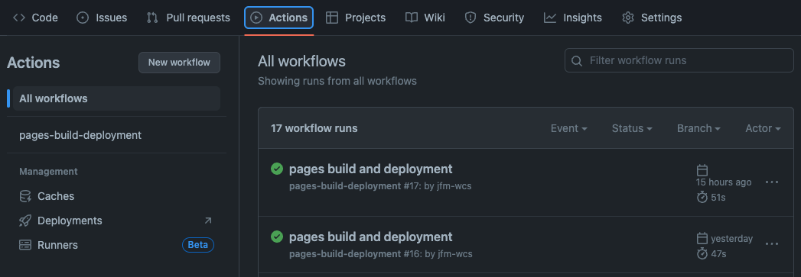

# Workshops jekyll theme

[⬅  Version FR](./README-FR)

[Jekyll](https://jekyllrb.com/) is a static site engine integrated into [Github pages](https://pages.github.com/). In
particular, it enables markdown files to be generated and formatted in HTML. This theme, in the Wild colors, is a
suggested layout for the markdown format teaching aids used during training sessions.

## How it works

Create your content (workshop, support, dojo, etc.) on a Git repository as you probably already do.
Write your instructions in the **README.md** file, using the hierarchy of `<h1>`, `<h2>`, `<h3>`,... headings to
structure your document.
Publish on Github pages using this theme from the [Wild Code School](https://www.wildcodeschool.com/) graphic charter.

## Installation

Installation is performed using a `_config.yml` file, to be placed at the root of your folder, in which you simply enter
the code below:

```yml
remote_theme: WildCodeSchool/workshops-jekyll-theme
```

And that's it! The `workshops-jekyll-theme` is now defined for use when you publish your project via Github pages (see
the [deploy](#deploy) section).

You can also download this <a href="./config-sample.yml" download="_config.yml">_config.yml</a> file, already set up with
the configuration variables described below.

## Configuration

Below is a list of variables that can be added to the `_config.yml` file if you wish to customize the display.

| Variable        |  Type  |  Default   | Description                                                                                                                                                            |
|-----------------|:------:|:----------:|------------------------------------------------------------------------------------------------------------------------------------------------------------------------|
| **style**       | string |   _dev_    | Indicate the dominant color of the page.<br/> Possible values: _dev_, _data_, _ciber_, _design_ and _wild_. The themes use the colors associated with each curriculum. |
| **title**       | string |    none    | Title displayed in the `<header>` section of the page.                                                                                                                 |
| **description** | string |    none    | Text displayed under the `<header>` section title                                                                                                                      |
| **type**        | string | _Workshop_ | Short text displayed under the `<header>` section (logo line).                                                                                                         |
| **main_image**  | string |    none    | Cover image displayed before the main content (indicate an **http** address or the **relative path** of a file from the root of your folder).                          |
| **show_clone**  |  bool  |   false    | Show/hide pre-populated `git clone <address-of-your-repository>` command.                                                                                              |
| **show_toc**    |  bool  |    true    | Show/hide table of contents.                                                                                                                                           |

### Example

```yaml
remote_theme: WildCodeSchool/workshops-jekyll-theme

style: data
title: Basic workshop
description: Default tempate with cover image
type: Data theme
main_image: https://cdn.pixabay.com/photo/2020/08/09/14/25/business-5475661_1280.jpg
show_clone: true
```

<a href="./examples/configuration" target="_blank">See the rendering</a> of this configuration.

## Templates

Two templates are available.

- **default** (default template):  Sections are automatically generated from `<h1>` and `<h2>` headers.
- **tic-tac**: Sections generated from `<h1>` headers occupy a full width. Sections generated from `<h2>` headers are positioned on a two-column grid, alternating right/left.

### Select
Template selection is also made via the `_config.yml` file using the `layout` key in the `default` table, indicating the template name as follows:

```yaml
defaults:
  - scope:
      path: "" # an empty string here means all files in the project, if any
    values:
      layout: tic-tac # the tic-tac template will be used
```

## Styles

A few explanations about the formatting applied to certain HTML elements.

The theme formats all [basic HTML elements that can be generated in markdown](https://daringfireball.net/projects/markdown/basics).  
Since **Jekyll** relies on the [kramdown](https://kramdown.gettalong.org/) library to convert
markdown files into HTML, it is possible to call up CSS classes at the time of input, thanks to the
syntax `{: .class-name-css }`. This code should be placed on the line adjoining the line(s) to be formatted. This is the case for
the _Alert info_ and _Alert warning_ blocks shown below.

### Alert info

Use kramdown syntax `{: .alert-info }`

```markdown
Some text
{: .alert-info }
```

Will create a paragraphe with CSS class `alert-info` ⬇

Some text
{: .alert-info }

### Alert warning

```markdown
Some text…  
Some text…  
{: .alert-warning }
```

Will create a paragraphe with CSS class `alert-warning` ⬇

Some text…  
Some text…  
{: .alert-warning }

### Blockquotes

```markdown

> Further details [with links](#), `inline code` or block of code
> ```php
> $content = 'block of code'
> ```

```

Creates a multi-line `<blockquote>` ⬇
> Further details [with links](#), `inline code` or block of code
> ```php
> $content = 'block of code'
> ```

### Images

Images retain an _inline_ display type.

```markdown


```

⬇  


The CSS properties `max-width: 100%` and `height: auto;` are applied to them to be responsive.

```markdown

```

⬇  


### Table of content

For the two templates currently available (**default** and **tic-tac**), the table of content is generated from
headings `<h1>`, `<h2>`, `<h3>`, and `<h4>` as long as the semantic hierarchy is respected (don't go directly from a `<h2>` to a `<h4>`, for example).  
The content table can be disabled ([see Configuration](#configuration)). In all cases, it is not displayed in _mobile_ view.

## Deploy

Deployment on Github Pages is done via the **Settings** > **Pages** tab of a Github repository.  
Select the reference branch (usually _main_) and click on _Save_.
  
The page will be accessible a few moments later at `https://<account_name>.github.io/<repository_name>`.

Each update to the _main_ branch will automatically trigger a new deployment to be followed via the **Action** tab.

More information on [Github pages](https://docs.github.com/fr/pages/getting-started-with-github-pages/configuring-a-publishing-source-for-your-github-pages-site#publishing-with-a-custom-github-actions-workflow).

## Test localy
To test locally your contents before deploy, you must [install Jekyll](https://jekyllrb.com/docs/installation/#guides) on your laptop.  
When it's done, add this <a href="./sample-gemfile" download="Gemfile">Gemfile</a> file at the root of your foler and run the following command:

```bash
bundle install
```

Finally, launch Jekyll with the command :

```bash
bundle exec jekyll serve --livereload
```

And browse [http://localhost:4000](http://localhost:4000).

Jekyll generates the files (HTML, CSS, JS, etc.) in the `_site` folder, just as _Github Pages_ will do on deployment.  
Remember to add this folder to your `.gitignore` file so as not to include them in your version history.  
```bash
# .gitignore
_site
```

## Demo

- <a href="./examples/workshop-default" target="_blank">Basic workshop</a>
- <a href="./examples/configuration" target="_blank">Basic workshop</a> (with cover image)
- <a href="./examples/tic-tac" target="_blank">Chip and Dale workshop</a> (no table of content)
- <a href="./examples/tic-tac-design" target="_blank">Chip and Dale workshop</a> (with table of content)


